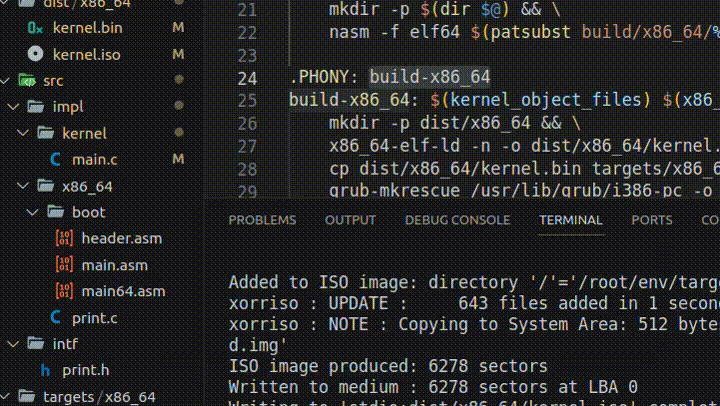

# MyOS - Custom Operating System

This repository contains the source code for "MyOS," a custom operating system developed from scratch using assembly and C code.

## Introduction

This project aims to create a basic operating system using assembly and C languages. The following instructions will guide you through the process of building and running the OS.

## Building the Operating System

### Step 1: Building the Docker Image

To build the Docker image required for compiling the OS, execute the following command:

```bash
docker build buildenv -t myos-buildenv 
```

### Step 2: Using the Docker Container

After building the Docker image, run the container to work within the environment for building the OS. Use the following command:

```bash
docker run --rm -it -v "$(pwd)":/root/env myos-buildenv
```
This command will launch a Docker container with access to the project directory for building the operating system.

### Step 3: Building the Operating System

Once inside the Docker container, execute the command below to create the .iso image:

```bash
make build-x86_64
```

This command will compile the code and generate the OS image.


## Running the Operating System
Once the .iso image is created, you can run it using QEMU:

```bash
qemu-system-x86_64 -cdrom dist/x86_64/kernel.iso
```



## References

- [OSDev.org](https://wiki.osdev.org/Expanded_Main_Page)
- [James Molloy's Tutorial](http://www.jamesmolloy.co.uk/tutorial_html/index.html)
- [Bran's Kernel Development Tutorial](http://www.osdever.net/bkerndev/Docs/intro.htm)
- [OSDev Wiki](https://wiki.osdev.org/Main_Page)

## License

This project is licensed under the MIT License - see the [LICENSE.md](LICENSE) file for details


